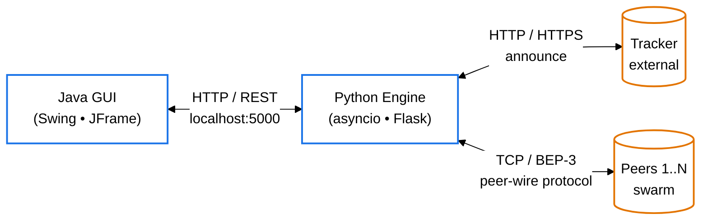
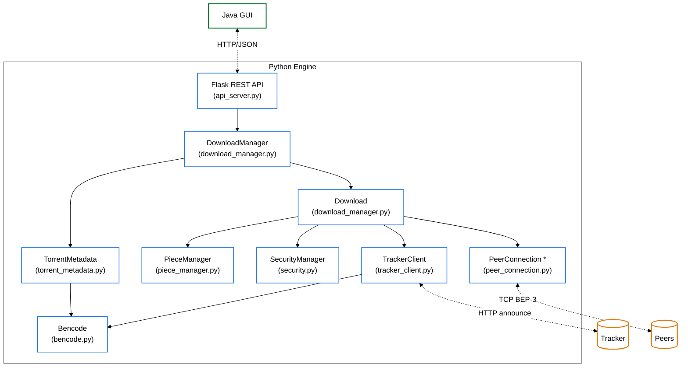

# Fig-02 — תרשים ארכיטקטורה (Top-Down Level Design)

**פרק בספר**: 11.1 (ארכיטקטורה כללית).
**סוג**: תרשים ארכיטקטורה דו-רמתי.

---

## רמה 1 — ארכיטקטורה כללית (Top Level)



---

## רמה 2 — פירוט המודולים בתוך Python Engine



---

## מקרא

- **מסגרת כחולה**: רכיב פנימי של Python Engine.
- **מסגרת ירוקה**: רכיב פנימי של Java GUI.
- **מסגרת כתומה**: רכיב חיצוני (Tracker, Peers).
- **חץ מלא (`──►`)**: תלות ישירה / קריאת מתודה.
- **חץ מקווקו (`-.->`)**: תקשורת רשת.
- **כוכבית ליד `PeerConnection *`**: ריבוי instances — אחד לכל peer פעיל.

## מקור לאימות מול הקוד

| מחלקה | קובץ | שורה |
|---|---|---|
| Flask app | `python_engine/api_server.py` | — |
| `DownloadManager` | `python_engine/download_manager.py` | 816 |
| `Download` | `python_engine/download_manager.py` | 87 |
| `PieceManager` | `python_engine/piece_manager.py` | 148 |
| `PeerConnection` | `python_engine/peer_connection.py` | 98 |
| `TrackerClient` | `python_engine/tracker_client.py` | 135 |
| `SecurityManager` | `python_engine/security.py` | 79 |
| `TorrentMetadata` | `python_engine/torrent_metadata.py` | 31 |
| `encode` / `decode` | `python_engine/bencode.py` | — |

---

## איך להעתיק את התרשים ל-Google Docs / Word

### דרך 1 — Mermaid Live Editor (מומלץ, הכי קל)

1. היכנס ל-**https://mermaid.live**
2. מחק את הקוד שמופיע בצד שמאל.
3. העתק את **קוד ה-Mermaid** מהקובץ הזה (החל מ-`%%{init...` ועד לסוף ה-`classDef`, **בלי** השורות עם ה-` ``` `).
4. הדבק בצד שמאל. התרשים יופיע בצד ימין על רקע לבן.
5. למעלה לחץ על **Actions → PNG** (או **SVG** לאיכות גבוהה יותר).
6. שמור את הקובץ במחשב.
7. ב-Google Docs / Word: `Insert → Image → Upload from computer` ובחר את הקובץ.

### דרך 2 — GitHub Preview + Screenshot

1. דחפנו את הקובץ ל-GitHub. פתח אותו בדפדפן:
   `https://github.com/Adamzvulun/Project_Gal/blob/claude/update-project-images-GCU04/docs/Fig-02.md`
2. GitHub מציג את התרשים אוטומטית על רקע לבן.
3. עשה צילום מסך (Windows: `Win+Shift+S`; Mac: `Cmd+Shift+4`) של אזור התרשים.
4. הדבק ב-Google Docs (`Ctrl+V`).

### דרך 3 — VS Code

1. התקן את התוסף **Markdown Preview Mermaid Support**.
2. פתח את `docs/Fig-02.md` ולחץ `Ctrl+Shift+V` ל-Preview.
3. צלם מסך של התרשים.

> **טיפ**: דרך 1 (Mermaid Live + PNG/SVG) נותנת את האיכות הגבוהה ביותר ואת הרקע הכי נקי.
