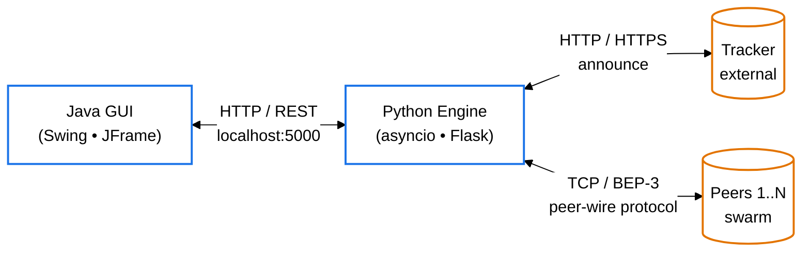
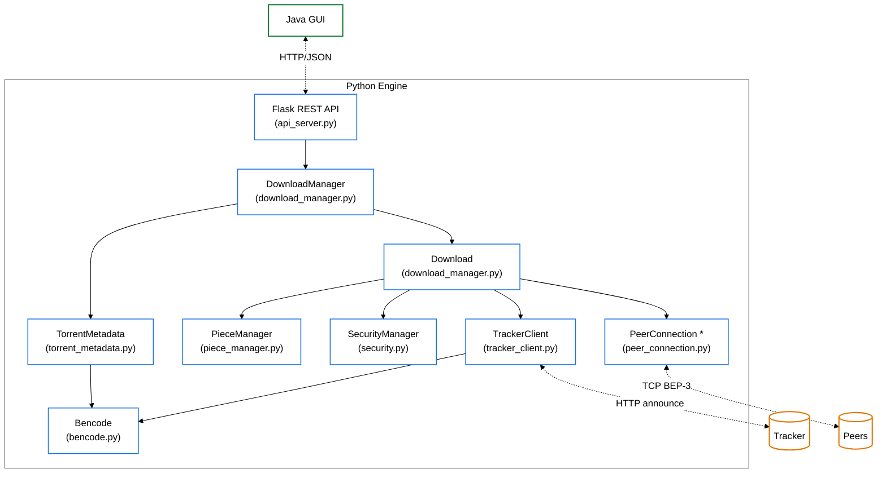

# Fig-02 — תרשים ארכיטקטורה (Top-Down Level Design)

**פרק בספר**: 11.1 (ארכיטקטורה כללית).
**סוג**: תרשים ארכיטקטורה דו-רמתי.

---

## רמה 1 — ארכיטקטורה כללית (Top Level)



---

## רמה 2 — פירוט המודולים בתוך Python Engine



---

## מקרא

- **מסגרת כחולה**: רכיב פנימי של Python Engine.
- **מסגרת ירוקה**: רכיב פנימי של Java GUI.
- **מסגרת כתומה**: רכיב חיצוני (Tracker, Peers).
- **חץ מלא (`──►`)**: תלות ישירה / קריאת מתודה.
- **חץ מקווקו (`-.->`)**: תקשורת רשת.
- **כוכבית ליד `PeerConnection *`**: ריבוי instances — אחד לכל peer פעיל.

## מקור לאימות (קוד)

<table dir="rtl" style="border-collapse:collapse;border:1pt solid #333333;font-family:'David','Times New Roman',serif;font-size:12pt;background:#FFFFFF;">
  <thead>
    <tr style="background-color:#DCE6F1;">
      <th style="border:1pt solid #333333;padding:4px 10px;font-weight:bold;text-align:right;">מודול בתרשים</th>
      <th style="border:1pt solid #333333;padding:4px 10px;font-weight:bold;text-align:right;">קובץ מקור</th>
      <th style="border:1pt solid #333333;padding:4px 10px;font-weight:bold;text-align:right;">מחלקה ראשית</th>
    </tr>
  </thead>
  <tbody>
    <tr>
      <td style="border:0.5pt solid #999999;padding:4px 10px;text-align:right;">Flask REST API</td>
      <td style="border:0.5pt solid #999999;padding:4px 10px;text-align:right;"><code>python_engine/api_server.py</code></td>
      <td style="border:0.5pt solid #999999;padding:4px 10px;text-align:right;">(Flask app)</td>
    </tr>
    <tr>
      <td style="border:0.5pt solid #999999;padding:4px 10px;text-align:right;">DownloadManager</td>
      <td style="border:0.5pt solid #999999;padding:4px 10px;text-align:right;"><code>python_engine/download_manager.py</code></td>
      <td style="border:0.5pt solid #999999;padding:4px 10px;text-align:right;"><code>DownloadManager</code> (line 816)</td>
    </tr>
    <tr>
      <td style="border:0.5pt solid #999999;padding:4px 10px;text-align:right;">Download</td>
      <td style="border:0.5pt solid #999999;padding:4px 10px;text-align:right;"><code>python_engine/download_manager.py</code></td>
      <td style="border:0.5pt solid #999999;padding:4px 10px;text-align:right;"><code>Download</code> (line 87)</td>
    </tr>
    <tr>
      <td style="border:0.5pt solid #999999;padding:4px 10px;text-align:right;">PieceManager</td>
      <td style="border:0.5pt solid #999999;padding:4px 10px;text-align:right;"><code>python_engine/piece_manager.py</code></td>
      <td style="border:0.5pt solid #999999;padding:4px 10px;text-align:right;"><code>PieceManager</code> (line 148)</td>
    </tr>
    <tr>
      <td style="border:0.5pt solid #999999;padding:4px 10px;text-align:right;">PeerConnection</td>
      <td style="border:0.5pt solid #999999;padding:4px 10px;text-align:right;"><code>python_engine/peer_connection.py</code></td>
      <td style="border:0.5pt solid #999999;padding:4px 10px;text-align:right;"><code>PeerConnection</code> (line 98)</td>
    </tr>
    <tr>
      <td style="border:0.5pt solid #999999;padding:4px 10px;text-align:right;">TrackerClient</td>
      <td style="border:0.5pt solid #999999;padding:4px 10px;text-align:right;"><code>python_engine/tracker_client.py</code></td>
      <td style="border:0.5pt solid #999999;padding:4px 10px;text-align:right;"><code>TrackerClient</code> (line 135)</td>
    </tr>
    <tr>
      <td style="border:0.5pt solid #999999;padding:4px 10px;text-align:right;">SecurityManager</td>
      <td style="border:0.5pt solid #999999;padding:4px 10px;text-align:right;"><code>python_engine/security.py</code></td>
      <td style="border:0.5pt solid #999999;padding:4px 10px;text-align:right;"><code>SecurityManager</code> (line 79)</td>
    </tr>
    <tr>
      <td style="border:0.5pt solid #999999;padding:4px 10px;text-align:right;">TorrentMetadata</td>
      <td style="border:0.5pt solid #999999;padding:4px 10px;text-align:right;"><code>python_engine/torrent_metadata.py</code></td>
      <td style="border:0.5pt solid #999999;padding:4px 10px;text-align:right;"><code>TorrentMetadata</code> (line 31)</td>
    </tr>
    <tr>
      <td style="border:0.5pt solid #999999;padding:4px 10px;text-align:right;">Bencode</td>
      <td style="border:0.5pt solid #999999;padding:4px 10px;text-align:right;"><code>python_engine/bencode.py</code></td>
      <td style="border:0.5pt solid #999999;padding:4px 10px;text-align:right;"><code>encode</code> / <code>decode</code></td>
    </tr>
  </tbody>
</table>

---

## איך להעתיק את התרשים ל-Google Docs / Word

### דרך 1 — Mermaid Live Editor (מומלץ, הכי קל)

1. היכנס ל-**https://mermaid.live**
2. מחק את הקוד שמופיע בצד שמאל.
3. העתק את **קוד ה-Mermaid** מהקובץ הזה (החל מ-`%%{init...` ועד לסוף ה-`classDef`, **בלי** השורות עם ה-` ``` `).
4. הדבק בצד שמאל. התרשים יופיע בצד ימין על רקע לבן.
5. למעלה לחץ על **Actions → PNG** (או **SVG** לאיכות גבוהה יותר).
6. שמור את הקובץ במחשב.
7. ב-Google Docs / Word: `Insert → Image → Upload from computer` ובחר את הקובץ.

### דרך 2 — GitHub Preview + Screenshot

1. דחפנו את הקובץ ל-GitHub. פתח אותו בדפדפן:
   `https://github.com/Adamzvulun/Project_Gal/blob/claude/update-project-images-GCU04/docs/Fig-02.md`
2. GitHub מציג את התרשים אוטומטית על רקע לבן.
3. עשה צילום מסך (Windows: `Win+Shift+S`; Mac: `Cmd+Shift+4`) של אזור התרשים.
4. הדבק ב-Google Docs (`Ctrl+V`).

### דרך 3 — VS Code

1. התקן את התוסף **Markdown Preview Mermaid Support**.
2. פתח את `docs/Fig-02.md` ולחץ `Ctrl+Shift+V` ל-Preview.
3. צלם מסך של התרשים.

> **טיפ**: דרך 1 (Mermaid Live + PNG/SVG) נותנת את האיכות הגבוהה ביותר ואת הרקע הכי נקי.

## איך להעתיק את הטבלה ל-Google Docs / Word

הטבלה בקובץ זה מעוצבת ב-HTML inline-styles **שמותאמים בדיוק לסגנון הספר**
(גבול חיצוני `#333333`, גבולות פנימיים `#999999`, רקע שורת כותרת `#DCE6F1`,
פונט David 12pt). העיצוב נשמר אוטומטית בהעתקה:

1. פתח את הקובץ ב-GitHub / VS Code Preview (בעיניים בהירות).
2. סמן את הטבלה בעכבר (גרור מהפינה השמאלית-עליונה לפינה הימנית-תחתונה).
3. `Ctrl+C` (Mac: `Cmd+C`).
4. ב-Google Docs: `Ctrl+V`. הטבלה נכנסת כטבלה אמיתית עם העיצוב הנכון.
