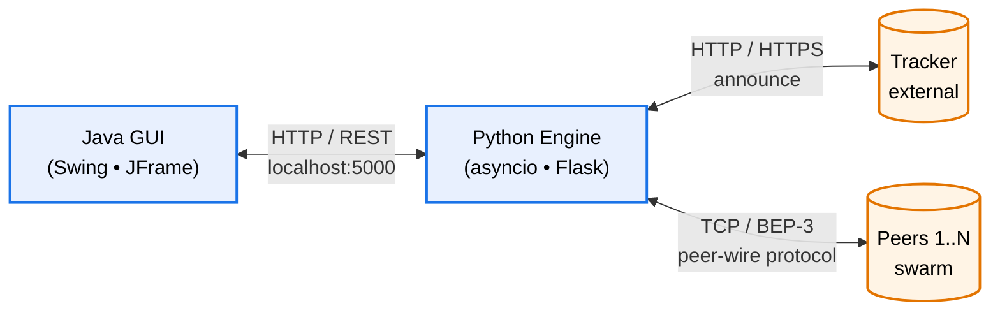
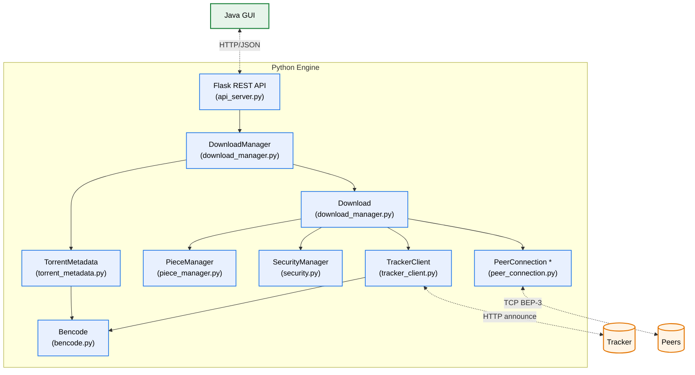

# Fig-02 — תרשים ארכיטקטורה (Top-Down Level Design)

**פרק בספר**: 11.1 (ארכיטקטורה כללית).
**סוג**: תרשים ארכיטקטורה דו-רמתי.

---

## רמה 1 — ארכיטקטורה כללית (Top Level)

---

## רמה 2 — פירוט המודולים בתוך Python Engine

---

## מקרא

- **כחול**: רכיב פנימי של המערכת (Python Engine).
- **ירוק**: רכיב פנימי של המערכת (Java GUI).
- **כתום**: רכיב חיצוני (Tracker, Peers).
- **חץ מלא (`──►`)**: תלות ישירה / קריאת מתודה.
- **חץ מקווקו (`-.->`)**: תקשורת רשת.
- **כוכבית ליד `PeerConnection *`**: ריבוי instances — אחד לכל peer פעיל.

## מקור לאימות (קוד)

| מודול בתרשים | קובץ מקור | מחלקה ראשית |
|---|---|---|
| Flask REST API | `python_engine/api_server.py` | (Flask app) |
| DownloadManager | `python_engine/download_manager.py` | `DownloadManager` (line 816) |
| Download | `python_engine/download_manager.py` | `Download` (line 87) |
| PieceManager | `python_engine/piece_manager.py` | `PieceManager` (line 148) |
| PeerConnection | `python_engine/peer_connection.py` | `PeerConnection` (line 98) |
| TrackerClient | `python_engine/tracker_client.py` | `TrackerClient` (line 135) |
| SecurityManager | `python_engine/security.py` | `SecurityManager` (line 79) |
| TorrentMetadata | `python_engine/torrent_metadata.py` | `TorrentMetadata` (line 31) |
| Bencode | `python_engine/bencode.py` | `encode` / `decode` |
