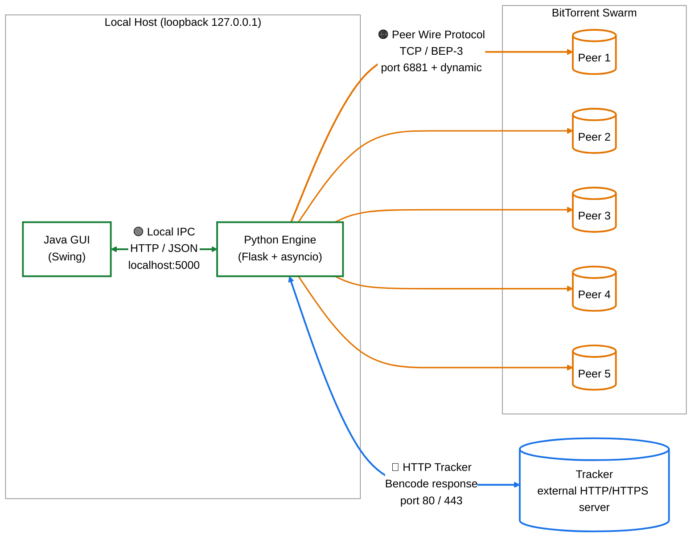

# Fig-03 — תרשים ארכיטקטורת רשת (Network Architecture)

**פרק בספר**: 11.4 (תקשורת ופרוטוקולי רשת).
**סוג**: תרשים זרימת רשת — שלוש שכבות תקשורת שונות.

---

## התרשים



---

## שלוש שכבות התקשורת

| צבע | שכבה | פרוטוקול | פורט | שימוש |
|---|---|---|---|---|
| 🟢 **ירוק** | Local IPC | HTTP / JSON | `localhost:5000` | GUI ↔ Engine (REST) — תמיד על loopback בלבד |
| 🔵 **כחול** | HTTP Tracker | HTTP / HTTPS עם תשובה ב-Bencode | `80` / `443` | Engine ↔ Tracker — `announce` תקופתי |
| 🟠 **כתום** | Peer Wire | TCP raw + BEP-3 | `6881` + דינמי | Engine ↔ Peers — `handshake`, `BITFIELD`, `REQUEST`, `PIECE`, `HAVE`, `CHOKE`/`UNCHOKE` |

> **הערה**: רק 5 peers מוצגים כייצוג סכמטי של ה-swarm. בפועל ה-`Download` יכול לנהל עד עשרות חיבורים מקבילים (`max_workers` מוגבל בקוד).

---

## מקור לאימות (קוד)

| ערך בתרשים | מיקום בקוד |
|---|---|
| `localhost:5000` | `python_engine/api_server.py:499` — `run_server(host='127.0.0.1', port=5000)` |
| `port 6881` (BitTorrent default) | `python_engine/tracker_client.py:23` — `DEFAULT_PORT = 6881` |
| TCP פתיחת חיבור ל-peer | `python_engine/peer_connection.py:166` — `asyncio.open_connection(self.ip, self.port)` |
| Handshake 68 בתים | `python_engine/peer_connection.py:20` — `HANDSHAKE_LEN = 68` |
| `Bencode response` מ-tracker | `python_engine/tracker_client.py:97-128` — parser של רשימת peers בפורמט compact/dict |

---

## איך להעתיק את התרשים ל-Google Docs / Word

1. גש ל-**https://mermaid.live**
2. מחק את הקוד שמופיע משמאל.
3. העתק את הקוד מתחת ל-` ```mermaid ` עד לפני ` ``` ` (כולל שורת `%%{init...`).
4. הדבק משמאל. התרשים מתעדכן מימין על רקע לבן.
5. **Actions → PNG** (או SVG לאיכות גבוהה).
6. ב-Google Docs: `Insert → Image → Upload from computer`.

חלופה: פתח את הקובץ ב-GitHub וצלם את התרשים (`Win+Shift+S` / `Cmd+Shift+4`).
