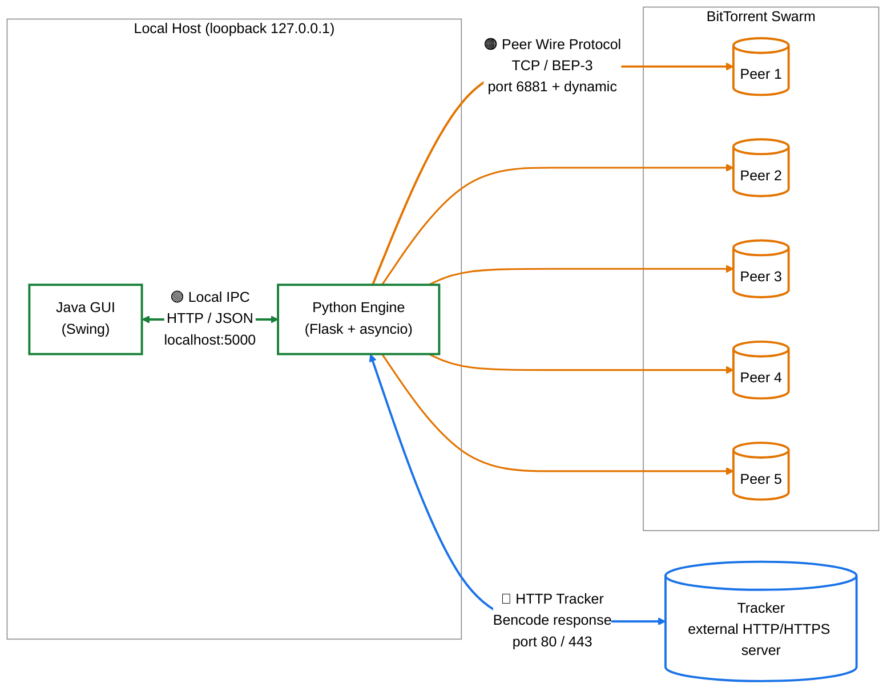

# Fig-03 — תרשים ארכיטקטורת רשת (Network Architecture)

**פרק בספר**: 11.4 (תקשורת ופרוטוקולי רשת).
**סוג**: תרשים זרימת רשת — שלוש שכבות תקשורת שונות.

---

## התרשים



---

## שלוש שכבות התקשורת

<table dir="rtl" style="border-collapse:collapse;border:1pt solid #333333;font-family:'David','Times New Roman',serif;font-size:12pt;background:#FFFFFF;">
  <thead>
    <tr style="background-color:#DCE6F1;">
      <th style="border:1pt solid #333333;padding:4px 10px;font-weight:bold;text-align:right;">צבע</th>
      <th style="border:1pt solid #333333;padding:4px 10px;font-weight:bold;text-align:right;">שכבה</th>
      <th style="border:1pt solid #333333;padding:4px 10px;font-weight:bold;text-align:right;">פרוטוקול</th>
      <th style="border:1pt solid #333333;padding:4px 10px;font-weight:bold;text-align:right;">פורט</th>
      <th style="border:1pt solid #333333;padding:4px 10px;font-weight:bold;text-align:right;">שימוש</th>
    </tr>
  </thead>
  <tbody>
    <tr>
      <td style="border:0.5pt solid #999999;padding:4px 10px;text-align:right;">🟢 <b>ירוק</b></td>
      <td style="border:0.5pt solid #999999;padding:4px 10px;text-align:right;">Local IPC</td>
      <td style="border:0.5pt solid #999999;padding:4px 10px;text-align:right;">HTTP / JSON</td>
      <td style="border:0.5pt solid #999999;padding:4px 10px;text-align:right;"><code>localhost:5000</code></td>
      <td style="border:0.5pt solid #999999;padding:4px 10px;text-align:right;">GUI ↔ Engine (REST) — תמיד על loopback בלבד</td>
    </tr>
    <tr>
      <td style="border:0.5pt solid #999999;padding:4px 10px;text-align:right;">🔵 <b>כחול</b></td>
      <td style="border:0.5pt solid #999999;padding:4px 10px;text-align:right;">HTTP Tracker</td>
      <td style="border:0.5pt solid #999999;padding:4px 10px;text-align:right;">HTTP / HTTPS עם תשובה ב-Bencode</td>
      <td style="border:0.5pt solid #999999;padding:4px 10px;text-align:right;"><code>80</code> / <code>443</code></td>
      <td style="border:0.5pt solid #999999;padding:4px 10px;text-align:right;">Engine ↔ Tracker — <code>announce</code> תקופתי</td>
    </tr>
    <tr>
      <td style="border:0.5pt solid #999999;padding:4px 10px;text-align:right;">🟠 <b>כתום</b></td>
      <td style="border:0.5pt solid #999999;padding:4px 10px;text-align:right;">Peer Wire</td>
      <td style="border:0.5pt solid #999999;padding:4px 10px;text-align:right;">TCP raw + BEP-3</td>
      <td style="border:0.5pt solid #999999;padding:4px 10px;text-align:right;"><code>6881</code> + דינמי</td>
      <td style="border:0.5pt solid #999999;padding:4px 10px;text-align:right;">Engine ↔ Peers — <code>handshake</code>, <code>BITFIELD</code>, <code>REQUEST</code>, <code>PIECE</code>, <code>HAVE</code>, <code>CHOKE</code>/<code>UNCHOKE</code></td>
    </tr>
  </tbody>
</table>

> **הערה**: רק 5 peers מוצגים כייצוג סכמטי של ה-swarm. בפועל ה-`Download` יכול לנהל עד עשרות חיבורים מקבילים (`max_workers` מוגבל בקוד).

---

## מקור לאימות (קוד)

<table dir="rtl" style="border-collapse:collapse;border:1pt solid #333333;font-family:'David','Times New Roman',serif;font-size:12pt;background:#FFFFFF;">
  <thead>
    <tr style="background-color:#DCE6F1;">
      <th style="border:1pt solid #333333;padding:4px 10px;font-weight:bold;text-align:right;">ערך בתרשים</th>
      <th style="border:1pt solid #333333;padding:4px 10px;font-weight:bold;text-align:right;">מיקום בקוד</th>
    </tr>
  </thead>
  <tbody>
    <tr>
      <td style="border:0.5pt solid #999999;padding:4px 10px;text-align:right;"><code>localhost:5000</code></td>
      <td style="border:0.5pt solid #999999;padding:4px 10px;text-align:right;"><code>python_engine/api_server.py:499</code> — <code>run_server(host='127.0.0.1', port=5000)</code></td>
    </tr>
    <tr>
      <td style="border:0.5pt solid #999999;padding:4px 10px;text-align:right;"><code>port 6881</code> (BitTorrent default)</td>
      <td style="border:0.5pt solid #999999;padding:4px 10px;text-align:right;"><code>python_engine/tracker_client.py:23</code> — <code>DEFAULT_PORT = 6881</code></td>
    </tr>
    <tr>
      <td style="border:0.5pt solid #999999;padding:4px 10px;text-align:right;">TCP פתיחת חיבור ל-peer</td>
      <td style="border:0.5pt solid #999999;padding:4px 10px;text-align:right;"><code>python_engine/peer_connection.py:166</code> — <code>asyncio.open_connection(self.ip, self.port)</code></td>
    </tr>
    <tr>
      <td style="border:0.5pt solid #999999;padding:4px 10px;text-align:right;">Handshake 68 בתים</td>
      <td style="border:0.5pt solid #999999;padding:4px 10px;text-align:right;"><code>python_engine/peer_connection.py:20</code> — <code>HANDSHAKE_LEN = 68</code></td>
    </tr>
    <tr>
      <td style="border:0.5pt solid #999999;padding:4px 10px;text-align:right;"><code>Bencode response</code> מ-tracker</td>
      <td style="border:0.5pt solid #999999;padding:4px 10px;text-align:right;"><code>python_engine/tracker_client.py:97-128</code> — parser של רשימת peers בפורמט compact/dict</td>
    </tr>
  </tbody>
</table>

---

## איך להעתיק את התרשים ל-Google Docs / Word

1. גש ל-**https://mermaid.live**
2. מחק את הקוד שמופיע משמאל.
3. העתק את הקוד מתחת ל-` ```mermaid ` עד לפני ` ``` ` (כולל שורת `%%{init...`).
4. הדבק משמאל. התרשים מתעדכן מימין על רקע לבן.
5. **Actions → SVG** (מומלץ — וקטורי) או **PNG**.
6. ב-Google Docs: `Insert → Image → Upload from computer`.

## איך להעתיק את הטבלאות ל-Google Docs / Word

הטבלאות בקובץ זה מעוצבות ב-HTML inline-styles **שמותאמים בדיוק לסגנון הספר**
(גבול חיצוני שחור `#333333`, גבולות פנימיים אפורים `#999999`, רקע שורת
כותרת `#DCE6F1`). העיצוב נשמר אוטומטית בהעתקה:

1. פתח את הקובץ ב-GitHub / VS Code Preview (בעיניים בהירות).
2. סמן את הטבלה בעכבר (גרור מהפינה השמאלית-עליונה לפינה הימנית-תחתונה).
3. `Ctrl+C` (Mac: `Cmd+C`).
4. ב-Google Docs: `Ctrl+V`. הטבלה נכנסת כטבלה אמיתית עם העיצוב הנכון.
