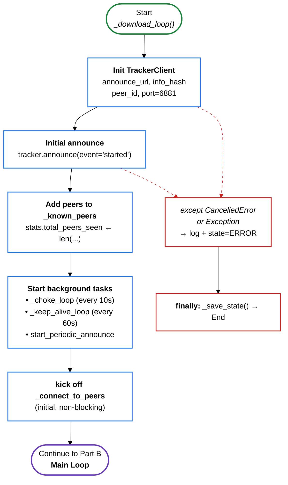
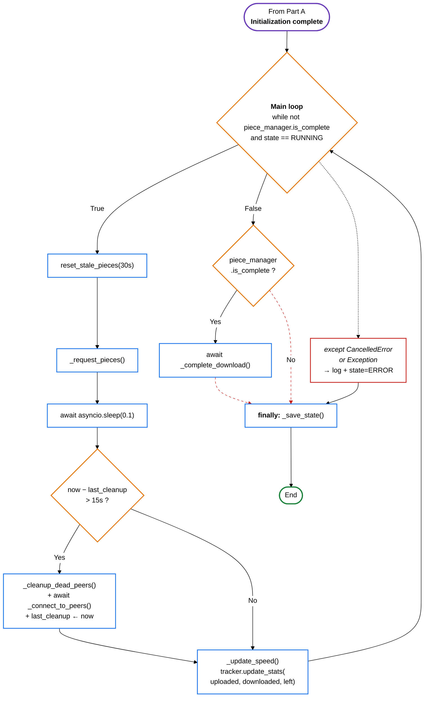

# Fig-04 — תרשים זרימה (Flowchart) של `_download_loop`

**פרק בספר**: 15.1 (האלגוריתם המרכזי).
**סוג**: תרשים זרימה (Flowchart) — מפוצל לשני חלקים בנקודה הגיונית.
**מקור הקוד**: `python_engine/download_manager.py:203-270`.

> התרשים פוצל לשני חלקים כדי להתאים בנוחות לעמוד A4 בודד.
> כל חלק עומד בפני עצמו עם מקרא משלו.

---

## חלק א' — אתחול (Initialization)

קטע זה מציג את ה-setup הראשוני שמתבצע לפני כניסה ללולאה הראשית.



### מקרא לחלק א'

| צורה | משמעות |
|---|---|
| אובאל ירוק | התחלה |
| מלבן כחול | פעולה / קריאת מתודה |
| אובאל סגול | קישור לחלק הבא |
| מלבן אדום (חץ מקווקו) | טיפול בחריגה |

---

## חלק ב' — לולאה ראשית ויציאה (Main Loop & Exit)

קטע זה מציג את הלולאה המרכזית, ההתפצלות בכל איטרציה, ושלוש דרכי היציאה האפשריות.



### מקרא לחלק ב'

| צורה | משמעות |
|---|---|
| אובאל סגול | קישור מהחלק הקודם |
| אובאל ירוק | סיום |
| מלבן כחול | פעולה / קריאת מתודה |
| מעוין כתום | החלטה / תנאי |
| מלבן אדום (חץ מקווקו) | טיפול בחריגה |

---

## טבלת אימות מול הקוד

| פעולה | קובץ | שורה |
|---|---|---|
| אתחול `TrackerClient` (port=6881) | `download_manager.py` | 207-212 |
| `announce(event='started')` ראשוני | `download_manager.py` | 217-218 |
| הוספת peers ל-`_known_peers` | `download_manager.py` | 219-221 |
| `_choke_loop` + `_keep_alive_loop` ברקע | `download_manager.py` | 225-226 |
| `start_periodic_announce(callback)` | `download_manager.py` | 229-231 |
| `_connect_to_peers` ראשוני | `download_manager.py` | 234 |
| תנאי הלולאה הראשית | `download_manager.py` | 238 |
| `reset_stale_pieces(30s)` | `download_manager.py` | 240 |
| `PIECE_REQUEST_TIMEOUT = 30` | `download_manager.py` | 33 |
| `_request_pieces()` | `download_manager.py` | 242 |
| `await sleep(0.1)` | `download_manager.py` | 243 |
| cleanup + reconnect (כל 15s) | `download_manager.py` | 247-250 |
| `PEER_CLEANUP_INTERVAL = 15` | `download_manager.py` | 34 |
| `_update_speed` + `tracker.update_stats` | `download_manager.py` | 253-258 |
| `_complete_download` | `download_manager.py` | 260-261 |
| `finally: _save_state()` | `download_manager.py` | 269-270 |

---

## הערות חשובות

- **non-blocking**: ה-`_connect_to_peers` מופעל כ-`asyncio.create_task` — הלולאה לא מחכה לסיום של 50 ניסיונות חיבור.
- **חוסמים** (SHA-1, כתיבה לדיסק) רצים ב-`ThreadPoolExecutor`, לא בלולאה הזו.
- **שלוש דרכי יציאה** מהלולאה (כולן מובילות ל-`_save_state`):
  1. `is_complete = True` → `_complete_download` → `_save_state`.
  2. `state != RUNNING` (pause/cancel) → ישירות ל-`_save_state`.
  3. חריגה (`CancelledError` / `Exception`) → לוג + state=ERROR → `_save_state`.

---

## איך להעתיק את התרשימים ל-Google Docs / Word

לכל אחד מ-2 החלקים בנפרד:

1. גש ל-**https://mermaid.live**
2. מחק את הקוד שמופיע משמאל.
3. העתק את הקוד של החלק הרצוי (מתחת ל-` ```mermaid ` עד לפני ה-` ``` ` הסוגר).
4. הדבק משמאל. התרשים מתעדכן מימין על רקע לבן.
5. **Actions → SVG** (מומלץ — וקטורי, לא מתפקסל בכווץ) או **PNG**.
6. ב-Google Docs: `Insert → Image → Upload from computer`.
7. הדבק כותרת מעל כל תמונה: *"Fig-04a — אתחול"* / *"Fig-04b — לולאה ראשית"*.

> **טיפ**: אם בוחרים בכל זאת בתרשים אחד שלם, אפשר להפוך את העמוד ל-Landscape:
> `Insert → Break → Section break (next page)` → `File → Page setup → Apply to: This section → Landscape`.
