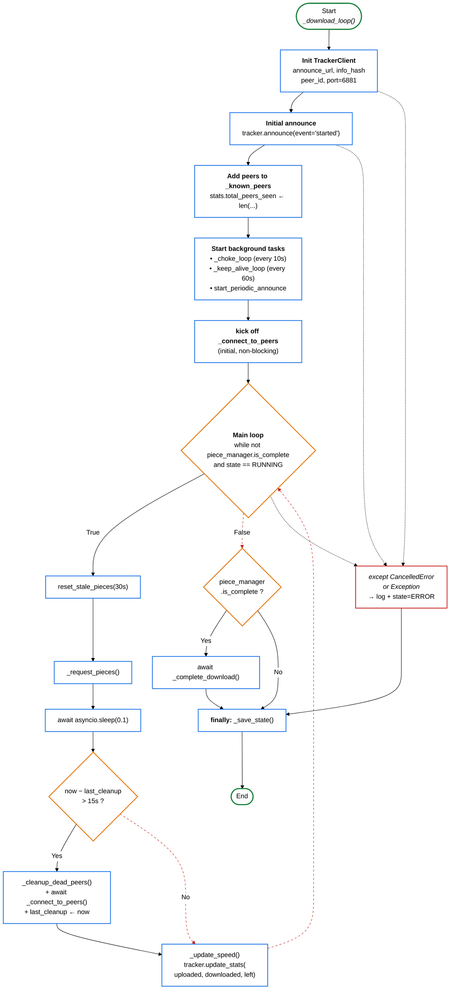

# Fig-04 — תרשים זרימה (Flowchart) של `_download_loop`

**פרק בספר**: 15.1 (האלגוריתם המרכזי).
**סוג**: תרשים זרימה (Flowchart).
**מקור הקוד**: `python_engine/download_manager.py:203-270`.

---

## התרשים



---

## מקרא

| צורה | משמעות |
|---|---|
| ⬭ (אובאל ירוק) | התחלה / סיום |
| ▭ (מלבן כחול) | פעולה / קריאת מתודה |
| ⬨ (מעוין כתום) | החלטה / תנאי |
| ▭ (מלבן אדום) | טיפול בחריגה |
| חץ מקווקו אדום | זרימת חריגה (`except`) |

---

## הסבר זרימה

| שלב | פעולה | מקור (line) |
|---|---|---|
| 1 | אתחול `TrackerClient` עם `port=6881` | `download_manager.py:207-212` |
| 2 | `announce(event='started')` ראשוני | `download_manager.py:217-218` |
| 3 | הוספת peers ל-`_known_peers` | `download_manager.py:219-221` |
| 4 | יצירת tasks ברקע: `_choke_loop`, `_keep_alive_loop` | `download_manager.py:225-226` |
| 5 | `await start_periodic_announce(callback)` | `download_manager.py:229-231` |
| 6 | `_connect_to_peers` ראשוני (non-blocking) | `download_manager.py:234` |
| 7 | לולאה ראשית | `download_manager.py:238` |
| 7a | `reset_stale_pieces(PIECE_REQUEST_TIMEOUT=30)` | `download_manager.py:240`, `:33` |
| 7b | `_request_pieces()` | `download_manager.py:242` |
| 7c | `await sleep(0.1)` | `download_manager.py:243` |
| 7d | כל 15 שניות: cleanup + reconnect | `download_manager.py:247-250`, `:34` |
| 7e | `_update_speed` + `tracker.update_stats` | `download_manager.py:253-258` |
| 8 | אם `is_complete` → `_complete_download` | `download_manager.py:260-261` |
| 9 | `finally: _save_state()` | `download_manager.py:269-270` |

---

## הערות חשובות

- **non-blocking**: ה-`_connect_to_peers` מופעל כ-`asyncio.create_task` — הלולאה לא מחכה לסיום של 50 ניסיונות חיבור.
- **חוסמים** (SHA-1, כתיבה לדיסק) רצים ב-`ThreadPoolExecutor`, לא בלולאה הזו.
- **שלוש דרכי יציאה** מהלולאה:
  1. `is_complete = True` → `_complete_download` → `_save_state`.
  2. `state != RUNNING` (pause/cancel) → ישירות ל-`_save_state`.
  3. חריגה (`CancelledError` / `Exception`) → לוג + state=ERROR → `_save_state`.

---

## איך להעתיק את התרשים ל-Google Docs / Word

1. גש ל-**https://mermaid.live**
2. מחק את הקוד שמופיע משמאל.
3. העתק את הקוד מתחת ל-` ```mermaid ` עד לפני ` ``` ` (כולל שורת `%%{init...`).
4. הדבק משמאל. התרשים מתעדכן מימין על רקע לבן.
5. **Actions → PNG** (או SVG לאיכות גבוהה).
6. ב-Google Docs: `Insert → Image → Upload from computer`.

חלופה: צילום מסך מ-GitHub במצב Light theme.
