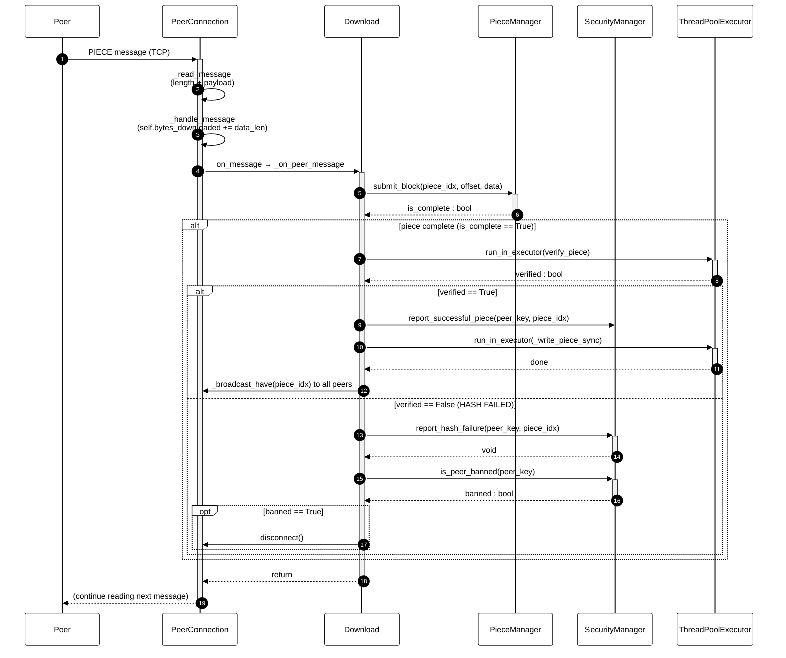

# Fig-05 — Sequence Diagram: קבלת `PIECE` מ-peer

**פרק בספר**: 15.9 (UML Sequence Diagram).
**סוג**: Sequence Diagram (UML).
**מקור הקוד**: `python_engine/peer_connection.py:288-336` ו-`python_engine/download_manager.py:358-411`.

---

## התרשים



---

## הסבר זרימה

הפעולות עוקבות אחר זרימת ההודעה PIECE — ההודעה היחידה ב-protocol BitTorrent
שמכילה נתוני קובץ. השלבים, לפי המספור בתרשים:

1. **`Peer → PeerConnection`** — peer מרוחק שולח הודעת PIECE על חיבור ה-TCP.
2. **`_read_message`** — קוראים את שדה ה-length (4 בתים) ואחריו את ה-payload
   (`piece_index`, `offset`, `block_data`).
3. **`_handle_message` (PIECE branch)** — מעדכן את `self.bytes_downloaded`
   ברמת ה-`PeerConnection`, מקטין `_pending_requests`, מעדכן
   `_download_samples` לחישוב מהירות.
4. **`on_message → _on_peer_message`** — ה-callback של `Download` מקבל את
   ההודעה. בודק שה-piece לא הושלם כבר (`PieceStatus.COMPLETED` → skip).
5. **`PieceManager.submit_block`** — שומר את הבלוק במאגר של ה-piece, מסמן את
   הבלוק כ-RECEIVED, ומחזיר `True` אם כל הבלוקים של ה-piece הגיעו.
6. **בדיקת שלמות ה-piece** — אם `is_complete == True`, נכנסים לבלוק תיקוף.
7. **`run_in_executor(verify_piece)`** — חישוב SHA-1 על ה-piece המלא מועבר
   ל-`ThreadPoolExecutor` כדי לא לחסום את ה-event loop (~2ms לכל piece בגודל
   1MB).
8. **ענף SUCCESS (`verified == True`)**:
    - `report_successful_piece` — מעלה את `trust_score` של ה-peer.
    - `run_in_executor(_write_piece_sync)` — כתיבה לדיסק ב-thread נפרד.
    - `_broadcast_have` — שולח הודעת HAVE לכל ה-peers המחוברים כדי שיידעו
      שיש לנו piece חדש.
9. **ענף FAIL (`verified == False`, HASH MISMATCH)**:
    - `report_hash_failure` — מקטין `trust_score` ומגדיל `hash_failures`.
    - `is_peer_banned` — בודק אם הגיע לסף איסור (3 כשלים → ban).
    - אם כן, `conn.disconnect()` סוגר את ה-TCP socket.

---

## הסבר על ה-lifelines

- **`Peer`** — אקטור חיצוני, ה-peer המרוחק ברשת.
- **`PeerConnection`** — מנהל חיבור ה-TCP היחיד מול ה-peer הזה.
- **`Download`** — ה-orchestrator המרכזי של ה-torrent.
- **`PieceManager`** — מצב ה-pieces (מי הושלם, מי בתהליך, מי חסר).
- **`SecurityManager`** — מוניטין peers ו-ban-list.
- **`ThreadPoolExecutor`** — pool של 2 worker threads לפעולות חוסמות
  (SHA-1, כתיבה לדיסק).

---

## אימות מול הקוד

- `_read_message` — `python_engine/peer_connection.py:245`.
- `_handle_message` (PIECE branch, `bytes_downloaded += data_len`) —
  `python_engine/peer_connection.py:288, 322-324`.
- `_on_peer_message` (PIECE branch) — `python_engine/download_manager.py:358-411`.
- `piece.status == PieceStatus.COMPLETED` guard —
  `python_engine/download_manager.py:367-369`.
- `submit_block` — `python_engine/piece_manager.py:377`.
- `run_in_executor(verify_piece)` —
  `python_engine/download_manager.py:377-379`.
- `verify_piece` (SHA-1) — `python_engine/piece_manager.py` (within `Piece` /
  `PieceManager`).
- `report_successful_piece` — `python_engine/security.py:131`.
- `_write_piece_sync` — `python_engine/download_manager.py:619`.
- `_broadcast_have(piece_idx)` — `python_engine/download_manager.py:393`.
- `report_hash_failure` — `python_engine/security.py:109`.
- `is_peer_banned` — `python_engine/security.py` (called at
  `download_manager.py:409`).
- `should_ban` (ban threshold logic) — `python_engine/security.py:58`.
- `conn.disconnect()` — `python_engine/download_manager.py:411`.

---

## הערות חשובות

- **non-blocking I/O**: כל הפעולות "כבדות" (SHA-1, כתיבה לדיסק) מבוצעות
  ב-`ThreadPoolExecutor` עם `max_workers=2`. ה-event loop נשאר חופשי לקבל
  הודעות נוספות מ-peers אחרים.
- **guard נגד duplicates**: אם piece כבר הושלם (`PieceStatus.COMPLETED`)
  לפני שהבלוק הזה הגיע, ההודעה נזרקת בלי לעבד אותה. זה קורה כש-2 peers
  שולחים את אותו piece (race condition מקובל).
- **HAVE broadcast הוא fire-and-forget**: `asyncio.create_task(self._broadcast_have(...))`
  — לא מחכים שכל ה-peers יקבלו לפני שמטפלים בבלוק הבא.
- **ban policy**: לפי `should_ban` — peer נחסם אחרי `MAX_HASH_FAILURES=3`
  כשלים. החיבור נסגר אבל ה-peer נשמר ב-`_banned_peers` כדי שלא ננסה להתחבר
  אליו שוב.

---

## איך להעתיק את התרשים ל-Google Docs / Word

1. גש ל-**https://mermaid.live**
2. מחק את הקוד שמופיע משמאל.
3. העתק את הקוד מתחת ל-` ```mermaid ` עד לפני ה-` ``` ` הסוגר (כולל שורת
   `%%{init...`).
4. הדבק משמאל. התרשים מתעדכן מימין על רקע לבן.
5. **Actions → SVG** (מומלץ — וקטורי, ניתן להקטין בלי לאבד איכות) או **PNG**.
6. ב-Google Docs: `Insert → Image → Upload from computer`.

> **טיפ**: Sequence Diagrams בדרך כלל יוצאים רחבים. אם זה לא נכנס לעמוד,
> שקול **Landscape orientation** לעמוד הזה בלבד:
> `Insert → Break → Section break (next page)` → `File → Page setup →
> Apply to: This section → Landscape`.
