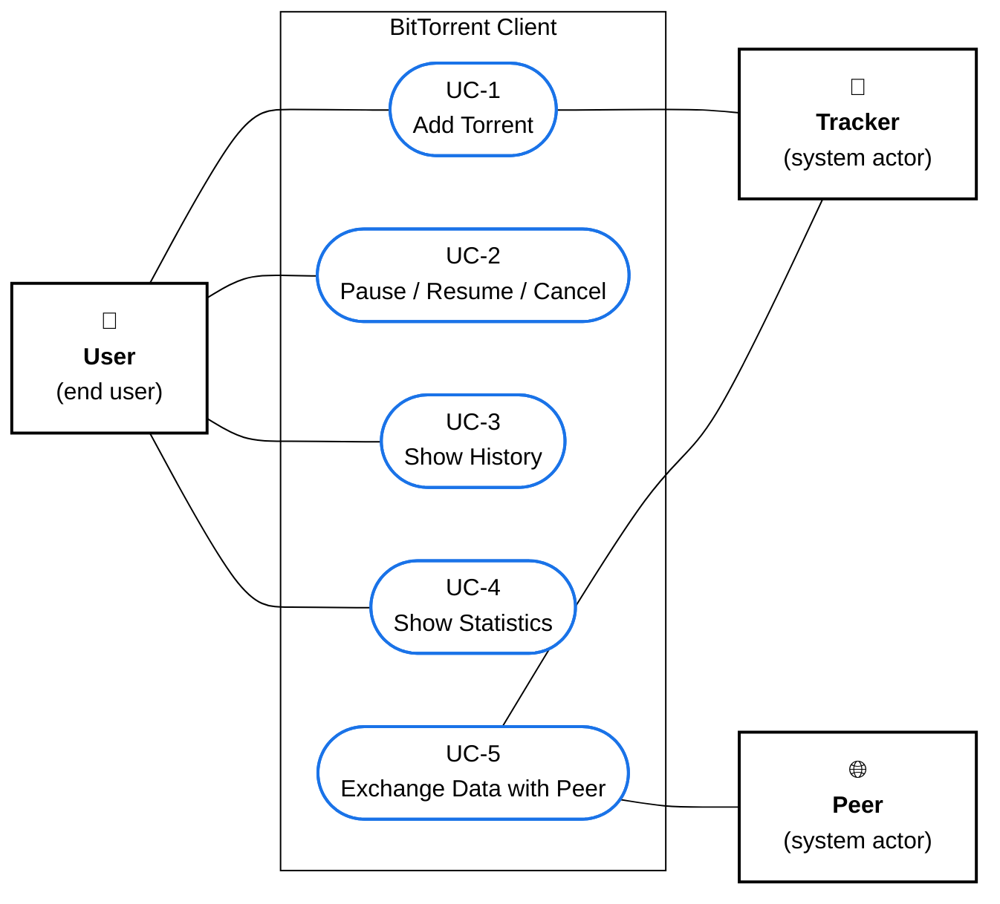

# Fig-06 — Use Case Diagram

**פרק בספר**: 15.7 + 15.8 (Use Case Diagram ורשימת UCs).
**סוג**: Use Case Diagram (UML).
**מקור התוכן**: `book/15-uml-use-cases.md` §15.2 ו-§15.8.

---

## התרשים



---

## הסבר על האקטורים

- **User (משתמש קצה)** — האדם שמפעיל את ה-GUI. יוזם את UC-1..4
  באמצעות לחיצות על כפתורי ה-toolbar וה-dialogs. אינו מעורב ב-UC-5,
  שמתבצע אוטומטית ברקע ע"י המערכת.
- **Tracker (system actor חיצוני)** — שרת ה-HTTP/HTTPS שמספק את רשימת
  ה-peers. מעורב ב-UC-1 (announce ראשוני בעת הוספת torrent) וב-UC-5
  (periodic announces במהלך ההורדה).
- **Peer (system actor חיצוני)** — לקוח BitTorrent נוסף ב-swarm. מתקשר
  עם המערכת רק במסגרת UC-5 (peer-wire protocol).

> **הערה על UC-5**: ה-actor הראשי שיוזם את UC-5 הוא **המערכת עצמה**
> (לולאת `_download_loop`), לא משתמש קצה. לכן הוא לא מחובר ל-`User`.

---

## הסבר על ה-Use Cases

**UC-1 — Add Torrent**

- **שחקן**: User.
- **תנאי מקדים**: המערכת רצה והשרת זמין.
- **זרימה**: User לוחץ "Add Torrent" → JFileChooser לקובץ `.torrent` →
  JFileChooser לתיקיית יעד → `POST /torrents` → `TorrentMetadata` נפרס →
  `Download` חדש נוצר → שורה חדשה בטבלה במצב `Running`.
- **חלופה**: קובץ פגום → `400 Bad Request` → Alert.

**UC-2 — Pause / Resume / Cancel**

- **שחקן**: User.
- **זרימה**: User בוחר שורה → לוחץ Pause / Resume / Cancel → GUI שולח
  קריאה ל-API → ה-Engine מפעיל `Download.pause/resume/cancel` →
  ה-state מתעדכן ב-polling הבא (תוך 500ms).
- **Cancel** דורש אישור (`JOptionPane.YES_NO`).

**UC-3 — Show History**

- **שחקן**: User.
- **זרימה**: User לוחץ "History" → `GET /history` → JOIN של `torrents`
  ו-`performance_stats` ב-SQLite → `JDialog` עם טבלה נפתח.
- **פעולה משלימה**: "Clear History" → `DELETE /history`.

**UC-4 — Show Statistics**

- **שחקן**: User.
- **זרימה**: User לוחץ "Statistics" → `AlgorithmStatsDialog` נפתח עם
  2 לשוניות: bar chart של בחירות rarest-first (ב-Java2D) ו-9 שדות
  מצרפיים.

**UC-5 — Exchange Data with Peer (אוטומטי)**

- **שחקן**: המערכת עצמה (system actor); Peer חיצוני.
- **זרימה**: `_connect_to_peers` יוצר `PeerConnection` → TCP + handshake →
  BITFIELD → INTERESTED אם ה-peer מציע piece שאנחנו צריכים → אם UNCHOKE,
  `select_piece_rarest_first` בוחר piece → REQUEST לכל בלוק → PIECE →
  SHA-1 verify → אם OK: כתיבה לדיסק + HAVE broadcast.

---

## רשימת ה-Use Cases (לפי §15.8 בספר)

- **UC-1** — Add Torrent (User, תדירות: פעמים בודדות).
- **UC-2** — Pause / Resume / Cancel (User, לפי הצורך).
- **UC-3** — Show History (User, פעמים בודדות).
- **UC-4** — Show Statistics (User, לפי הצורך).
- **UC-5** — Exchange Data with Peer (System, רציף — עשרות פעמים בשנייה).

---

## אימות מול הקוד

- **UC-1 — `POST /torrents` handler** — `python_engine/api_server.py` (Flask
  route), קורא ל-`DownloadManager.add_torrent`.
- **UC-1 — handler ב-GUI** — `java_gui/src/TorrentClientGUI.java` →
  `onAddTorrent`.
- **UC-2 — `pause/resume/cancel` ב-Engine** —
  `python_engine/download_manager.py` (מתודות `pause`, `resume`, `cancel`
  של `Download`).
- **UC-3 — `GET /history` + `DELETE /history`** —
  `python_engine/api_server.py` (Flask routes).
- **UC-3 — handler ב-GUI** — `java_gui/src/TorrentClientGUI.java` →
  `onShowHistory`.
- **UC-4 — `AlgorithmStatsDialog`** —
  `java_gui/src/AlgorithmStatsDialog.java`, נטען מ-`/algorithm-stats/<id>`
  ו-`/stats-summary`.
- **UC-5 — `_download_loop` ו-`_connect_to_peers`** —
  `python_engine/download_manager.py:203` ו-`:285`.
- **UC-5 — peer-wire protocol** — `python_engine/peer_connection.py`
  (handshake, BITFIELD, REQUEST, PIECE, HAVE).

---

## הערות עיצוביות

- **5 ביציות (ellipses)** בתוך מלבן גדול ש-מסמן את גבול המערכת
  (System Boundary).
- **קווים ללא ראשי חצים** — ב-UML, ה-Association בין actor ל-UC היא
  symmetric (לא directional). Mermaid `---` מספק את האפקט הזה.
- **שני סוגי actors**:
    - User — אקטור אנושי משמאל.
    - Tracker, Peer — system actors מימין (בקונבנציית UML הם נקראים
      גם "secondary actors" או "external actors").

---

## איך להעתיק את התרשים ל-Google Docs / Word

1. גש ל-**https://mermaid.live**
2. מחק את הקוד שמופיע משמאל.
3. העתק את הקוד מתחת ל-` ```mermaid ` עד לפני ה-` ``` ` הסוגר (כולל
   שורת `%%{init...`).
4. הדבק משמאל. התרשים מתעדכן מימין על רקע לבן.
5. **Actions → SVG** (מומלץ — וקטורי) או **PNG**.
6. ב-Google Docs: `Insert → Image → Upload from computer`.
