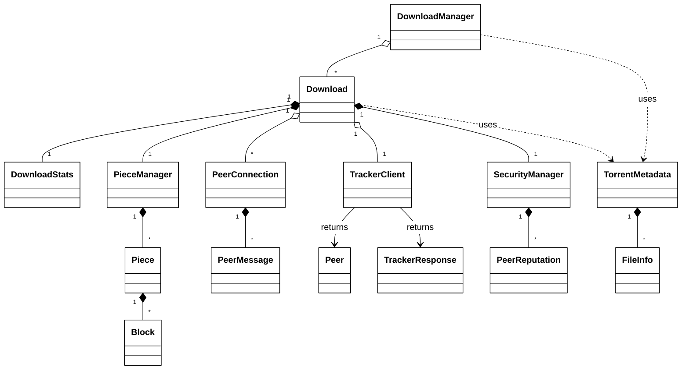

# Fig-07 — Class Diagram

**פרק בספר**: 15.11 (תרשים מחלקות).
**סוג**: Class Diagram (UML).
**מקור התוכן**: `book/15-uml-use-cases.md` §15.10-15.12 + סריקת קוד.

> התרשים מפוצל לשני חלקים (Python Engine ו-Java GUI). כדי להתאים לעמוד
> A4 אנכי, התרשימים מציגים רק את **שמות המחלקות** ואת הקשרים ביניהן.
> הפירוט המלא של fields ו-methods נמצא בסעיף "פירוט מחלקות" למטה.

---

## חלק א' — Python Engine (15 מחלקות)



---

## חלק ב' — Java GUI + הגשר ל-Python

```mermaid
%%{init: {'theme':'base', 'themeVariables': {'background':'#FFFFFF', 'primaryColor':'#FFFFFF', 'primaryBorderColor':'#000000', 'primaryTextColor':'#000000', 'lineColor':'#000000', 'classText':'#000000'}}}%%
classDiagram
    direction TB

    class JFrame
    class JDialog
    class JPanel
    class Exception

    class TorrentClientGUI
    class ApiService
    class TorrentStatus
    class ApiException
    class AlgorithmStatsDialog
    class BarChartPanel

    class FlaskAPI
    class DownloadManager_py

    JFrame    <|-- TorrentClientGUI
    JDialog   <|-- AlgorithmStatsDialog
    JPanel    <|-- BarChartPanel
    Exception <|-- ApiException

    TorrentClientGUI     "1" *-- "1" ApiService
    TorrentClientGUI     ..> AlgorithmStatsDialog : opens
    ApiService           "1" --> "*" TorrentStatus : returns
    ApiService           ..> ApiException : throws
    AlgorithmStatsDialog "1" *-- "1" BarChartPanel

    ApiService -- FlaskAPI : "HTTP/JSON REST localhost:5000"
    FlaskAPI   ..> DownloadManager_py : delegates
```

---

## פירוט מחלקות (Python Engine)

- **`DownloadManager`** — `Dict[str,Download] downloads`; `add_torrent`,
  `pause/resume/cancel_download(id)`, `get_all_status`.
- **`Download`** — `DownloadState state`, `DownloadStats stats`; `async
  start/pause/resume/cancel`, `get_status`, `_download_loop`,
  `_on_peer_message`.
- **`DownloadStats`** — `bytes_downloaded`, `bytes_uploaded`,
  `total_peers_seen`, `download_speed`.
- **`PieceManager`** — `List[Piece] pieces`, `Dict[int,int] _peer_frequency`;
  `select_piece_rarest_first`, `select_piece_random`, `submit_block`,
  `verify_piece`, `reset_stale_pieces`.
- **`Piece`** — `int index`, `bytearray _data`, `PieceStatus status`;
  `submit_block`, `verify_hash`.
- **`Block`** — `int offset`, `int length`, `bytes data`.
- **`PeerConnection`** — `ip`, `port`, `connected`, `peer_choking`; `async
  connect/disconnect`, `send_request`, `_read_message`, `_handle_message`.
- **`PeerMessage`** — `MessageType type`, `piece_index`, `block_offset`,
  `block_data`.
- **`TrackerClient`** — `announce_url`, `info_hash`, `port`; `async
  announce`, `start_periodic_announce`, `update_stats`.
- **`Peer`** — `ip`, `port`; `__hash__` (מאפשר שימוש ב-`Set[Peer]`).
- **`TrackerResponse`** — `interval`, `complete`, `incomplete`, `List[Peer]`.
- **`SecurityManager`** — `Dict[str,PeerReputation]`, `Set[str] _banned_peers`;
  `report_successful_piece`, `report_hash_failure`, `is_peer_banned`.
- **`PeerReputation`** — `peer_key`, `hash_failures`, `trust_score`;
  `should_ban`.
- **`TorrentMetadata`** — `announce`, `info_hash`, `pieces`, `total_size`,
  `piece_length`; `parse_from_file`.
- **`FileInfo`** — `path`, `length`.

## פירוט מחלקות (Java GUI)

- **`TorrentClientGUI extends JFrame`** — `JTable downloadTable`,
  `JTextArea logArea`, `ApiService apiService`, `Map previousStates`;
  `initComponents`, `onAddTorrent`, `onCancel`, `onShowHistory`,
  `updateTable`.
- **`ApiService`** — `String baseUrl`; `startDownload`,
  `pause/resume/cancel(id)`, `getAllStatus`, `getHistory`, `clearHistory`.
- **`TorrentStatus`** (nested ב-`ApiService`) — `id`, `name`, `state`,
  `progress`, `speed`.
- **`ApiException extends Exception`** (nested ב-`ApiService`) —
  `statusCode`.
- **`AlgorithmStatsDialog extends JDialog`** — `JTabbedPane tabs`,
  `BarChartPanel barChart`; `loadTorrents`, `refresh`.
- **`BarChartPanel extends JPanel`** (nested ב-`AlgorithmStatsDialog`) —
  `paintComponent(g)`.

---

## הקשרים (סימוני UML)

- **◆ קומפוזיציה** (`*--`) — חיים יחדיו. כשהבעלים מושמד, החלק מושמד.
- **◇ אגרגציה** (`o--`) — בעלות "רכה". החלקים יכולים להמשיך להתקיים.
- **──► אסוסיאציה** (`-->` / `..>`) — תלות חלשה (משתמש ב-, מחזיר, זורק).
- **──▷ ירושה** (`<|--`) — `extends` ב-Java / inheritance.

---

## הגשר בין שני ה-swimlanes (Python ↔ Java)

`ApiService` (Java) מתקשר עם Flask REST API (Python) דרך **HTTP/JSON
על loopback** בלבד (`127.0.0.1:5000`). אין shared memory, אין pipes,
אין file descriptors משותפים. לכל פעולה ב-`TorrentClientGUI` יש קריאה
ב-`ApiService` שעוברת ל-Flask ושם ל-`DownloadManager`.

---

## אימות מול הקוד

**Python**:

- `DownloadManager` — `python_engine/download_manager.py:816`.
- `Download` — `python_engine/download_manager.py:87`.
- `DownloadStats` — `python_engine/download_manager.py:55`.
- `PieceManager` — `python_engine/piece_manager.py:148`.
- `Piece` — `python_engine/piece_manager.py:67`.
- `Block` — `python_engine/piece_manager.py:26`.
- `PeerConnection` — `python_engine/peer_connection.py:98`.
- `PeerMessage` — `python_engine/peer_connection.py:42`.
- `TrackerClient` — `python_engine/tracker_client.py:135`.
- `Peer` — `python_engine/tracker_client.py:36`.
- `TrackerResponse` — `python_engine/tracker_client.py:56`.
- `TorrentMetadata`, `FileInfo` — `python_engine/torrent_metadata.py:31, 20`.
- `SecurityManager`, `PeerReputation` — `python_engine/security.py:79, 42`.

**Java**:

- `TorrentClientGUI extends JFrame` —
  `java_gui/src/TorrentClientGUI.java:30`.
- `ApiService` — `java_gui/src/ApiService.java:21`.
- `TorrentStatus` (nested) — `java_gui/src/ApiService.java:29`.
- `ApiException extends Exception` (nested) —
  `java_gui/src/ApiService.java:421`.
- `AlgorithmStatsDialog extends JDialog` —
  `java_gui/src/AlgorithmStatsDialog.java:16`.
- `BarChartPanel extends JPanel` (nested) —
  `java_gui/src/AlgorithmStatsDialog.java:390`.

---

## איך להעתיק את התרשימים ל-Google Docs / Word

### Google Docs — חייב PNG (לא SVG)

**Google Docs לא תומך ב-SVG**. הוא לא יודע להציג קובץ SVG כתמונה מוטמעת.
לכן השתמש ב-**PNG באיכות גבוהה**:

1. גש ל-**https://mermaid.live**
2. הדבק את קוד ה-Mermaid של החלק הרצוי בצד שמאל.
3. בצד ימין למעלה לחץ על **Actions → PNG**.
4. למעלה (לפני ההורדה) יש שדה **Maximum Width / Height** ושדה
   **Scale**. הגדל את **Scale ל-3x** או **4x** — זה ייתן PNG חד בהרבה
   שלא יתפקסל בהדבקה לעמוד.
5. ב-Google Docs: `Insert → Image → Upload from computer`.
6. אחרי ההדבקה תוכל לכווץ את התמונה (גרור פינות) — היא תישאר חדה כי
   ייצאת ב-Scale גבוה.

### Microsoft Word — SVG עובד ישירות

**Word כן תומך ב-SVG** (גרסת Word 2016+):

1. ב-Mermaid Live: **Actions → SVG**.
2. ב-Word: `Insert → Pictures → This Device` ובחר את ה-SVG.
3. ה-SVG נטען כ-vector — תוכל לכווץ ולהגדיל בלי לאבד איכות בכלל.

### חלופה לוקטור ב-Google Docs (פתרון עוקף)

אם אתה חייב וקטור ב-Docs:

1. הורד SVG מ-mermaid.live.
2. פתח אותו ב-**Inkscape** (חינמי) או ב-Illustrator.
3. ייצא כ-**PDF**.
4. ב-Google Docs: `Insert → Image → Upload from computer` —
   PDF לא ייעלה כתמונה ישירה, אז:
   - הפוך את ה-PDF ל-PNG באיכות גבוהה דרך https://cloudconvert.com
   - או: השתמש ב-Google Drive — העלה את ה-PDF לדרייב, פתח, צלם מסך
     ברזולוציה גבוהה.

### Landscape orientation לעמוד התרשים

לתרשימי class גדולים, גם אחרי הקיצורים, מומלץ להפוך את העמוד ל-Landscape:

1. הצב את הסמן בעמוד שלפני התרשים.
2. `Insert → Break → Section break (next page)`.
3. `File → Page setup → Apply to: This section → Orientation: Landscape`.
4. הוסף עוד `Section break` אחרי התרשים וחזור ל-Portrait לשאר העמודים.

> **המלצה**: Class Diagrams לרוב נראים הכי טוב ב-Landscape. גם אם הם
> נכנסים ל-Portrait, ב-Landscape יש להם מקום נשימה.
