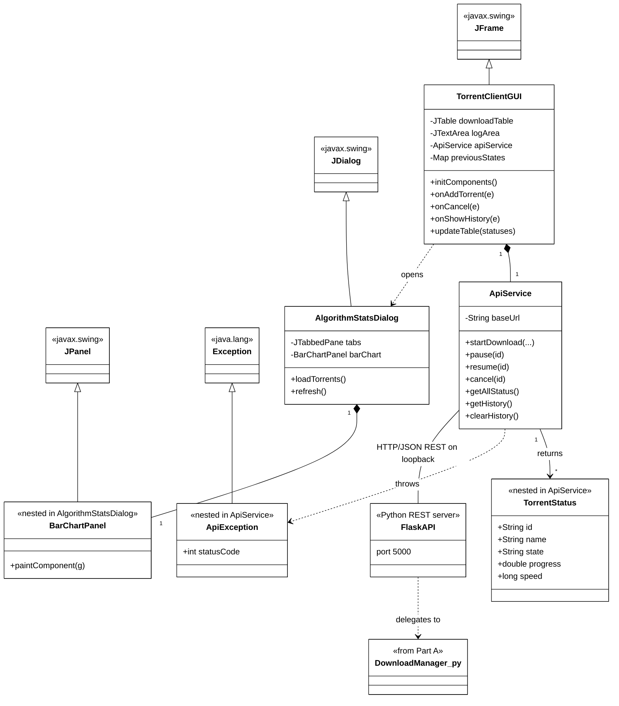

# Fig-07 — Class Diagram

**פרק בספר**: 15.11 (תרשים מחלקות).
**סוג**: Class Diagram (UML).
**מקור התוכן**: `book/15-uml-use-cases.md` §15.10-15.12 + סריקת קוד.

> התרשים מפוצל לשני חלקים (Python Engine ו-Java GUI) כדי להתאים לעמוד
> בודד. הגשר ביניהם מוצג בסוף כקשר נפרד.

---

## חלק א' — Python Engine (15 מחלקות)

```mermaid
%%{init: {'theme':'base', 'themeVariables': {'background':'#FFFFFF', 'primaryColor':'#FFFFFF', 'primaryBorderColor':'#000000', 'primaryTextColor':'#000000', 'lineColor':'#000000', 'classText':'#000000'}}}%%
classDiagram
    direction LR

    class DownloadManager {
        +Dict~str,Download~ downloads
        +add_torrent()
        +pause_download(id)
        +resume_download(id)
        +cancel_download(id)
        +get_all_status()
    }

    class Download {
        +DownloadState state
        +DownloadStats stats
        +async start()
        +async pause()
        +async resume()
        +async cancel()
        +get_status() dict
        -async _download_loop()
        -async _on_peer_message()
    }

    class DownloadStats {
        +bytes_downloaded
        +bytes_uploaded
        +total_peers_seen
        +download_speed
    }

    class PieceManager {
        +List~Piece~ pieces
        +Dict~int,int~ _peer_frequency
        +select_piece_rarest_first(peer)
        +select_piece_random(peer)
        +submit_block(idx, off, data)
        +verify_piece(idx) bool
        +reset_stale_pieces(timeout)
    }

    class Piece {
        +int index
        +bytearray _data
        +PieceStatus status
        +submit_block(off, data)
        +verify_hash() bool
    }

    class Block {
        +int offset
        +int length
        +bytes data
    }

    class PeerConnection {
        +str ip
        +int port
        +bool connected
        +bool peer_choking
        +async connect()
        +async send_request(idx, off, len)
        +async disconnect()
        -async _read_message()
        -async _handle_message(msg)
    }

    class PeerMessage {
        +MessageType type
        +int piece_index
        +int block_offset
        +bytes block_data
    }

    class TrackerClient {
        +str announce_url
        +bytes info_hash
        +int port
        +async announce(event)
        +async start_periodic_announce(cb)
        +update_stats(up, down, left)
    }

    class Peer {
        +str ip
        +int port
        +__hash__()
    }

    class TrackerResponse {
        +int interval
        +int complete
        +int incomplete
        +List~Peer~ peers
    }

    class SecurityManager {
        +Dict~str,PeerReputation~ _peer_reputations
        +Set~str~ _banned_peers
        +report_successful_piece(key, idx)
        +report_hash_failure(key, idx)
        +is_peer_banned(key) bool
    }

    class PeerReputation {
        +str peer_key
        +int hash_failures
        +float trust_score
        +should_ban() bool
    }

    class TorrentMetadata {
        +str announce
        +bytes info_hash
        +List~bytes~ pieces
        +int total_size
        +int piece_length
        +parse_from_file(path)
    }

    class FileInfo {
        +str path
        +int length
    }

    DownloadManager  "1" o-- "*" Download
    Download         "1" *-- "1" PieceManager
    Download         "1" *-- "1" SecurityManager
    Download         "1" *-- "1" DownloadStats
    Download         "1" o-- "1" TrackerClient
    Download         "1" o-- "*" PeerConnection
    PieceManager     "1" *-- "*" Piece
    Piece            "1" *-- "*" Block
    PeerConnection   "1" *-- "*" PeerMessage
    SecurityManager  "1" *-- "*" PeerReputation
    TrackerClient    --> TrackerResponse : returns
    TrackerClient    --> Peer : returns
    TorrentMetadata  "1" *-- "*" FileInfo
    Download         ..> TorrentMetadata : uses
    DownloadManager  ..> TorrentMetadata : uses
```



---

## חלק ב' — Java GUI (3 + 3 nested) + הגשר ל-Python



---

## הקשרים (סימוני UML)

- **◆ קומפוזיציה** (`*--`) — חיים יחדיו. כשהבעלים מושמד, החלק מושמד.
    - `Download` ◆ `PieceManager`, `SecurityManager`, `DownloadStats`
    - `PieceManager` ◆ `Piece` ◆ `Block`
    - `PeerConnection` ◆ `PeerMessage`
    - `SecurityManager` ◆ `PeerReputation`
    - `TorrentMetadata` ◆ `FileInfo`
    - `TorrentClientGUI` ◆ `ApiService`
    - `AlgorithmStatsDialog` ◆ `BarChartPanel`
- **◇ אגרגציה** (`o--`) — בעלות "רכה". החלקים יכולים להמשיך להתקיים.
    - `DownloadManager` ◇ `Download`
    - `Download` ◇ `TrackerClient`
    - `Download` ◇ `Dict[key, PeerConnection]`
- **──► אסוסיאציה / שימוש** (`-->` או `..>`) — תלות חלשה (לוקאלי /
  הוחזר מ-method / נקרא ב-import).
    - `TrackerClient` ──► `TrackerResponse`, `Peer`
    - `Download` --> `TorrentMetadata`
    - `ApiService` --> `TorrentStatus`, `ApiException`
- **──▷ ירושה** (`<|--`) — extends.
    - `TorrentClientGUI` ──▷ `JFrame`
    - `AlgorithmStatsDialog` ──▷ `JDialog`
    - `BarChartPanel` ──▷ `JPanel`
    - `ApiException` ──▷ `Exception`

---

## הגשר בין שני ה-swimlanes (Python ↔ Java)

ה-`ApiService` (Java) מתקשר עם ה-Flask REST API (Python) בלבד דרך
**HTTP/JSON על loopback** (`127.0.0.1` פורט `5000`). אין shared memory,
אין pipes, אין file descriptors משותפים.

לכל קריאת UI ב-`TorrentClientGUI` מקבילה קריאת API ב-`ApiService`
שעוברת ל-Flask, נכנסת ל-`DownloadManager`, ומחזירה JSON שמומר בחזרה
ל-`TorrentStatus` (Java).

---

## רשימת המחלקות

**Python Engine — 15 מחלקות עיקריות + 4 enums + 3 exceptions = 22 (לפי
`book/15-uml-use-cases.md` §15.11)**:

- **מנהל מערכת**: `DownloadManager`, `Download`, `DownloadStats`,
  `DownloadState` (enum), `AlgorithmType` (enum).
- **pieces**: `PieceManager`, `Piece`, `Block`, `PieceStatus` (enum).
- **רשת**: `PeerConnection`, `PeerMessage`, `MessageType` (enum),
  `PeerConnectionError`, `TrackerClient`, `Peer`, `TrackerResponse`,
  `TrackerError`.
- **metadata**: `TorrentMetadata`, `FileInfo`, `TorrentMetadataError`.
- **bencode**: `BencodeDecodeError`, `BencodeEncodeError`.
- **security**: `SecurityManager`, `PeerReputation`, `SecurityEvent`.

**Java GUI — 3 מחלקות ראשיות + 3 nested**:

- ראשיות: `TorrentClientGUI`, `ApiService`, `AlgorithmStatsDialog`.
- Nested: `TorrentStatus` (ב-`ApiService`), `ApiException`
  (ב-`ApiService`), `BarChartPanel` (ב-`AlgorithmStatsDialog`).
- בנוסף: `ProgressBarRenderer` (helper ב-`TorrentClientGUI`) ו-
  `TorrentEntry` (helper ב-`AlgorithmStatsDialog`).

---

## אימות מול הקוד

**Python**:

- `DownloadManager` — `python_engine/download_manager.py:816`.
- `Download` — `python_engine/download_manager.py:87`.
- `DownloadStats` — `python_engine/download_manager.py:55`.
- `DownloadState`, `AlgorithmType` (enums) — `download_manager.py:37, 47`.
- `PieceManager` — `python_engine/piece_manager.py:148`.
- `Piece` — `python_engine/piece_manager.py:67`.
- `Block` — `python_engine/piece_manager.py:26`.
- `PieceStatus` (enum) — `python_engine/piece_manager.py:19`.
- `PeerConnection` — `python_engine/peer_connection.py:98`.
- `PeerMessage` — `python_engine/peer_connection.py:42`.
- `MessageType` (enum) — `python_engine/peer_connection.py:28`.
- `TrackerClient` — `python_engine/tracker_client.py:135`.
- `Peer` — `python_engine/tracker_client.py:36`.
- `TrackerResponse` — `python_engine/tracker_client.py:56`.
- `TorrentMetadata`, `FileInfo` — `python_engine/torrent_metadata.py:31, 20`.
- `SecurityManager`, `PeerReputation`, `SecurityEvent` —
  `python_engine/security.py:79, 42, 24`.

**Java**:

- `TorrentClientGUI extends JFrame` —
  `java_gui/src/TorrentClientGUI.java:30`.
- `ApiService` — `java_gui/src/ApiService.java:21`.
- `TorrentStatus` (nested) — `java_gui/src/ApiService.java:29`.
- `ApiException extends Exception` (nested) —
  `java_gui/src/ApiService.java:421`.
- `AlgorithmStatsDialog extends JDialog` —
  `java_gui/src/AlgorithmStatsDialog.java:16`.
- `BarChartPanel extends JPanel` (nested) —
  `java_gui/src/AlgorithmStatsDialog.java:390`.

---

## הערות עיצוביות

- **שני התרשימים מציגים את אותה מערכת** — חלק א' (Python) וחלק ב' (Java)
  לא יושבים זה ליד זה אבל הם משלימים. הגשר ביניהם מוצג כשורה אחת בחלק ב'
  עם תווית `HTTP/JSON REST on loopback`.
- **מצוין רק החלק החיוני של כל מחלקה** — לא כל ה-fields וה-methods. זה
  Class Diagram ברמת overview, לא ספציפיקציית API.
- **המספרים (1, *)** — multiplicity. למשל `Download "1" *-- "1" PieceManager`
  אומר: לכל `Download` יש בדיוק `PieceManager` אחד. ו-`PieceManager "1"
  *-- "*" Piece` אומר: לכל `PieceManager` יש כמה pieces.
- **Enums ו-Exceptions** לא מוצגים בתרשים כדי לחסוך מקום ולשמור על
  קריאות. הם מוזכרים ברשימה למטה.

---

## איך להעתיק את התרשימים ל-Google Docs / Word

לכל אחד מ-2 החלקים בנפרד:

1. גש ל-**https://mermaid.live**
2. מחק את הקוד שמופיע משמאל.
3. העתק את הקוד של החלק הרצוי (מתחת ל-` ```mermaid ` עד לפני ה-` ``` `).
4. הדבק משמאל. התרשים מתעדכן מימין על רקע לבן.
5. למעלה בצד ימין: **Actions → PNG**. הגדל **Scale ל-3x** או **4x**
   לפני ההורדה כדי לקבל תמונה חדה.
6. ב-Google Docs: `Insert → Image → Upload from computer`.
7. הוסף כותרת מעל כל תמונה: *"Fig-07a — Python Engine"* /
   *"Fig-07b — Java GUI + Bridge"*.

> **Word 2016+**: תומך גם ב-SVG ישירות. ב-mermaid.live: **Actions → SVG**,
> ואז ב-Word: `Insert → Pictures → This Device`. ה-SVG נשאר וקטורי.
>
> **Google Docs**: לא תומך ב-SVG. השתמש ב-PNG ב-Scale גבוה.
