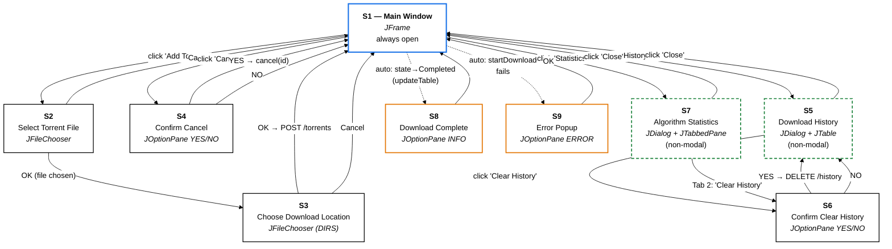

# Fig-08 — Screen Flow Diagram

**פרק בספר**: 16 (תרשים מסכים).
**סוג**: Screen Flow Diagram.
**מקור התוכן**: `book/16-screen-flow.md` ו-`java_gui/src/TorrentClientGUI.java`.

---

## התרשים



---

## תיאור 9 המסכים

- **S1 — Main Window** (`JFrame`): הציר המרכזי של האפליקציה. תמיד פתוח.
  גודל 900×600. כולל toolbar, `JTable` של הורדות, `JTextArea` ללוגים,
  `statusLabel` בתחתית.
- **S2 — Select Torrent File** (`JFileChooser`): בחירת קובץ `.torrent`.
  מסנן `FileNameExtensionFilter("Torrent Files (*.torrent)", "torrent")`.
- **S3 — Choose Download Location** (`JFileChooser` עם `DIRECTORIES_ONLY`):
  בחירת תיקיית יעד. נפתח אחרי S2.
- **S4 — Confirm Cancel** (`JOptionPane.showConfirmDialog`):
  אישור לפני ביטול הורדה. YES → `apiService.cancel(id)`.
- **S5 — Download History** (`JDialog non-modal`, 820×380):
  `JTable` עם 9 עמודות, נטען מ-`GET /history`.
- **S6 — Confirm Clear History** (`JOptionPane.showConfirmDialog`):
  אישור לפני `DELETE /history`. נקרא משני המקומות — S5 וגם S7 Tab 2.
- **S7 — Algorithm Statistics** (`JDialog non-modal`, 800×560 + `JTabbedPane`):
  שתי לשוניות — Piece Selection (bar chart Java2D) ו-General Stats
  (9 שדות מצרפיים).
- **S8 — Download Complete** (`JOptionPane.INFORMATION_MESSAGE`):
  אוטומטי. מופעל ב-`updateTable` כשמתגלה מעבר state ל-`Completed`.
- **S9 — Error Popup** (`JOptionPane.ERROR_MESSAGE`):
  אוטומטי. רק בכשל של `apiService.startDownload(...)` — שאר השגיאות
  נכתבות ל-Event Log בלי לחסום את המשתמש.

---

## מקרא לתרשים

- **מסגרת כחולה (S1)** — המסך הראשי, היחיד שאינו modal.
- **מסגרת שחורה (S2, S3, S4, S6)** — דיאלוג modal (חוסם את S1 עד לסגירה).
- **מסגרת ירוקה מקווקווות (S5, S7)** — `JDialog(modal=false)`, ניתן
  להשאיר אותם פתוחים תוך שימוש ב-S1.
- **מסגרת כתומה (S8, S9)** — חלונות שמופעלים אוטומטית, לא ע"י לחיצת
  משתמש ישירה.
- **חצים מלאים** — מעבר יזום ע"י משתמש (לחיצה / אישור).
- **חצים מקווקווים** — מעבר אוטומטי (state change / exception).

---

## זרימות אופייניות

**זרימה 1 — הוספת torrent חדש**:

```
S1 → click Add Torrent → S2 → choose .torrent + OK → S3 →
     choose dir + OK → (POST /torrents) → S1 (עם שורה חדשה)
```

**זרימה 2 — ביטול הורדה**:

```
S1 → select row → click Cancel → S4 → YES → (DELETE /torrents/<id>) → S1
```

**זרימה 3 — צפייה בהיסטוריה וניקויה**:

```
S1 → click History → S5 → click Clear → S6 → YES →
     (DELETE /history) → S5 (ריקה) → click Close → S1
```

**זרימה 4 — סיום הורדה (אוטומטי)**:

```
S1 (polling each 500ms) → state == COMPLETED detected →
   S8 (popup) → user clicks OK → S1
```

**זרימה 5 — שגיאת startDownload (אוטומטי)**:

```
S1 → click Add → S2 → S3 → POST /torrents fails →
     S9 (error popup) → user clicks OK → S1
```

---

## אימות מול הקוד

- **S1 — JFrame setup, toolbar, JTable, JTextArea** —
  `java_gui/src/TorrentClientGUI.java` (constructor + `initComponents`).
- **S1 → S2 → S3 (Add flow)** — `TorrentClientGUI.java:241` —
  `onAddTorrent(ActionEvent e)`.
- **S1 → S4 (Cancel flow)** — `TorrentClientGUI.java:320` —
  `onCancel(ActionEvent e)`; `JOptionPane.showConfirmDialog` ב-line 324.
- **S1 → S5 → S6 (History flow)** — `TorrentClientGUI.java:340` —
  `onShowHistory(ActionEvent e)`; ה-Clear ב-line 381-385.
- **S5 שאינו modal** — `setModal(false)` על ה-`JDialog` (ניתן לראות ב-
  `onShowHistory`).
- **S7 — `AlgorithmStatsDialog`** — `java_gui/src/AlgorithmStatsDialog.java`.
- **S7 → S6 (Clear History מ-Tab 2)** — בקוד של `AlgorithmStatsDialog`
  (Tab 2 כפתור "Clear History").
- **S8 — auto-trigger ע"י polling** — `TorrentClientGUI.java:480` —
  `updateTable(List<TorrentStatus>)`; ה-popup מופעל ב-`previousStates`
  diff (`previousStates` הוגדר ב-line 65).
- **S9 — auto-trigger ע"י כשל startDownload** —
  `TorrentClientGUI.java:283-285` — `JOptionPane.showMessageDialog(this,
  ..., "Error", JOptionPane.ERROR_MESSAGE)`.

---

## הערות חשובות

- **רק S1 נשאר פתוח כל הזמן**. S5 ו-S7 הם non-modal אבל המשתמש סוגר
  אותם כשהוא רוצה.
- **S6 משותף לשני flows** — נקרא גם מ-S5 וגם מ-S7 Tab 2. בשני המקרים
  הוא מבצע את אותה פעולה (`DELETE /history`).
- **S8 ו-S9 שונים מהותית**: S8 הוא event-driven (polling מזהה מעבר
  state), S9 הוא exception-driven (כשל API call). שניהם modal אבל
  אינם דורשים פעולה מעבר ל-OK.
- **previousStates Map** ב-S1 הוא המנגנון שמבטיח ש-S8 יופיע פעם אחת
  בלבד לכל torrent (גם אם state נשאר `Completed` לאורך זמן).

---

## איך להעתיק את התרשים ל-Google Docs / Word

1. גש ל-**https://mermaid.live**
2. מחק את הקוד שמופיע משמאל.
3. העתק את הקוד מתחת ל-` ```mermaid ` עד לפני ה-` ``` ` הסוגר (כולל
   שורת `%%{init...`).
4. הדבק משמאל. התרשים מתעדכן מימין על רקע לבן.
5. **Actions → SVG** (מומלץ) או **PNG**.
6. ב-Google Docs: `Insert → Image → Upload from computer`.

> **טיפ**: ה-Screen Flow הזה רחב מהגובה שלו. אם זה לא נכנס בנוחות לעמוד,
> שקול **Landscape orientation**:
> `Insert → Break → Section break (next page)` → `File → Page setup →
> Apply to: This section → Landscape`.
