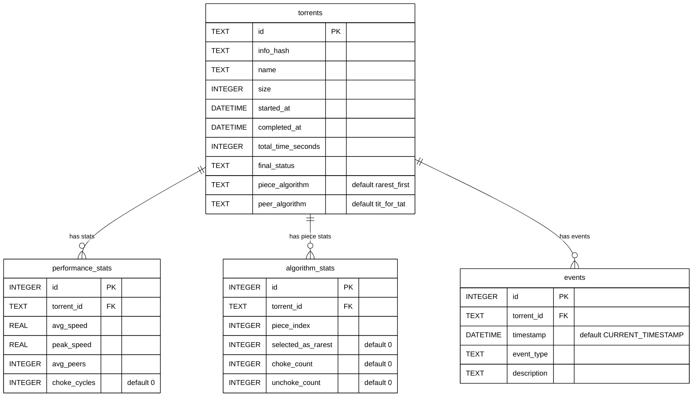

# Fig-13 — ERD (Entity-Relationship Diagram) של מסד הנתונים

**פרק בספר**: 22 (מסד הנתונים).
**סוג**: ERD בסימון Crow's Foot.
**מקור התוכן**: `python_engine/api_server.py:97-156` (סכמת SQLite).

---

## התרשים



---

## פירוט הישויות

**`torrents` (10 שדות)** — שורה אחת לכל torrent שהתחיל להוריד.

- `id` (PK, TEXT) — מזהה ייחודי (UUID hex).
- `info_hash` (TEXT) — SHA-1 על ה-info dict של ה-`.torrent`.
- `name` — שם הקובץ / התיקייה.
- `size` (INTEGER) — גודל הקובץ בבתים.
- `started_at`, `completed_at` (DATETIME) — חותמות זמן.
- `total_time_seconds` (INTEGER) — משך ההורדה.
- `final_status` (TEXT) — `Completed` / `Cancelled` / `Error`.
- `piece_algorithm` (TEXT, default `'rarest_first'`) — `rarest_first` או
  `random`. **מתווסף ע"י `ALTER TABLE`** (migration).
- `peer_algorithm` (TEXT, default `'tit_for_tat'`) — `tit_for_tat` או
  `round_robin`. **מתווסף ע"י `ALTER TABLE`** (migration).

**`performance_stats` (6 שדות)** — שורה אחת לכל torrent שהסתיים.

- `id` (PK INTEGER AUTOINCREMENT).
- `torrent_id` (FK → `torrents.id`).
- `avg_speed`, `peak_speed` (REAL) — KB/s.
- `avg_peers` (INTEGER) — ממוצע peers פעילים בו-זמנית.
- `choke_cycles` (INTEGER, default `0`) — מספר מחזורי choke/unchoke
  במהלך ההורדה. **מתווסף ע"י `ALTER TABLE`** (migration).

**`algorithm_stats` (6 שדות)** — שורה לכל piece + רשומת choke/unchoke.

- `id` (PK INTEGER AUTOINCREMENT).
- `torrent_id` (FK → `torrents.id`).
- `piece_index` (INTEGER).
- `selected_as_rarest` (INTEGER, default `0`) — counter של בחירות
  rarest-first.
- `choke_count`, `unchoke_count` (INTEGER, default `0`) — counters
  לאלגוריתם ה-peer.

**`events` (5 שדות)** — יומן אירועים גלובלי.

- `id` (PK INTEGER AUTOINCREMENT).
- `torrent_id` (FK → `torrents.id`, יכול להיות `NULL` לאירועים גלובליים).
- `timestamp` (DATETIME, default `CURRENT_TIMESTAMP`).
- `event_type` (TEXT) — קטגוריית האירוע.
- `description` (TEXT) — תיאור חופשי.

---

## הקשרים (Crow's Foot notation)

- **`torrents` 1—N `performance_stats`** — לכל torrent יש 0 או יותר
  רשומות של סטטיסטיקת ביצועים. בפועל נוצרת אחת בסוף ההורדה
  (`_complete_download` כותב אותה).
- **`torrents` 1—N `algorithm_stats`** — לכל torrent יש 0 או יותר
  רשומות per-piece. בפועל זה ~`num_pieces` רשומות לכל torrent
  (בערך 1,024–16,384 לקובץ 1–4GB).
- **`torrents` 1—N `events`** — לכל torrent יש 0 או יותר אירועים.
- **`torrent_id` ב-`events` יכול להיות `NULL`** (לאירועים גלובליים שלא
  קשורים ל-torrent ספציפי) — לכן הקשר הוא "0..N" ולא "1..N".

> בסימון Mermaid Crow's Foot: `||--o{` = (חובה אחד מצד torrents) ←—
> (אופציונלי רבים מצד הילד). זה תואם את ההגדרה: torrent חייב להתקיים
> אם יש לו performance_stats / events / וכו', אבל ה-children הם
> אופציונליים.

---

## אימות מול הקוד

- **`torrents` (CREATE TABLE)** — `python_engine/api_server.py:98-108`.
- **`performance_stats` (CREATE TABLE)** —
  `python_engine/api_server.py:111-119`.
- **`algorithm_stats` (CREATE TABLE)** —
  `python_engine/api_server.py:122-131`.
- **`events` (CREATE TABLE)** — `python_engine/api_server.py:134-142`.
- **ALTER TABLE `piece_algorithm` + `peer_algorithm`** —
  `python_engine/api_server.py:145-150`.
- **ALTER TABLE `choke_cycles`** — `python_engine/api_server.py:152-155`.

---

## הערות חשובות

- **אין `FOREIGN KEY ON DELETE`** בסכמה — ב-SQLite אכיפת FKs מושבתת
  כברירת מחדל. ה-`DELETE /history` מוחק ידנית את כל ארבע הטבלאות.
- **migrations**: `piece_algorithm`, `peer_algorithm`, `choke_cycles`
  התווספו אחרי ההגדרה הראשונית של הטבלאות, ולכן מוזרקים דרך
  `ALTER TABLE` בתוך `try/except` (מטפלים ב-`OperationalError` אם
  העמודה כבר קיימת).
- **אין אינדקסים נוספים** מעבר ל-PK. לטבלאות הללו אין שאילתות תכופות
  שדורשות זאת.
- **טיפוסי SQLite**: `INTEGER`, `REAL`, `TEXT`, `DATETIME` — אבל
  SQLite משתמש ב-type affinity, לא enforcing מחמיר.

---

## איך להעתיק את התרשים ל-Google Docs / Word

1. גש ל-**https://mermaid.live**
2. מחק את הקוד שמופיע משמאל.
3. העתק את הקוד מתחת ל-` ```mermaid ` עד לפני ה-` ``` ` הסוגר (כולל
   שורת `%%{init...`).
4. הדבק משמאל. התרשים מתעדכן מימין על רקע לבן.
5. **Actions → PNG**. הגדל **Scale ל-3x** או **4x** לפני ההורדה.
6. ב-Google Docs: `Insert → Image → Upload from computer`.

> **Word 2016+**: תומך גם ב-SVG ישירות (`Actions → SVG`, ואז
> `Insert → Pictures → This Device`).
>
> **Google Docs**: לא תומך ב-SVG. השתמש ב-PNG ב-Scale גבוה.
